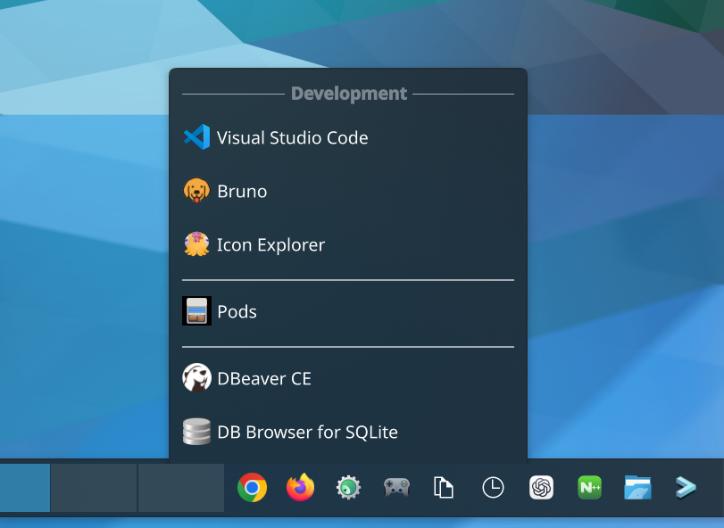
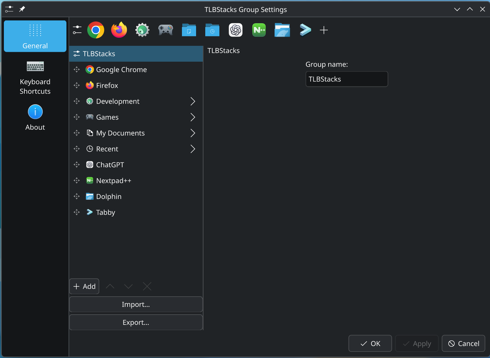
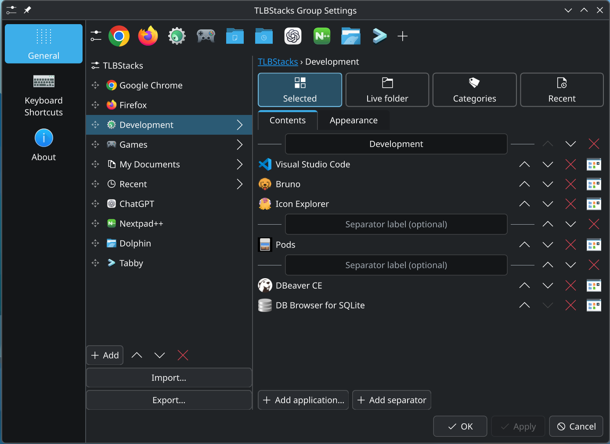

<h1>&nbsp;TLBStacks</h1>

**Application launchers, configurable stacks, and live menus for KDE Plasma 6.**

TLBStacks keeps related applications and files together without filling your
Plasma panel with individual widgets.

Use a standalone **TLBStacks** widget for a single application stack, or use
**TLBStacks Groups** to build a launcher bar containing both individual
application launchers and multiple stacks.

A TLBStacks Group can combine entries such as:

- individual application launchers
- manually selected application stacks
- application-category stacks
- recent or frequently used application stacks
- live folder stacks

Each stack behaves the same way whether it is used by itself or inside a group.

**TLBStacks is a launcher, not a task manager.** It does not display or manage
running windows. It is designed to work alongside Plasma's task manager if you
want one. For example, TLBStacks Groups can hold your launchers while
**Icons Only Task Manager** displays running applications.

Inspired by the original Windows True Launch Bar, TLBStacks is an independent
Linux project for KDE Plasma 6. It is not affiliated with TORDEX or the original
True Launch Bar.

<!-- NEW HERO IMAGE:
     Suggested filename: docs/images/group-hero.png
     TLBStacks Groups launcher bar containing individual application launchers
     and several stacks, with one stack open.
-->
<p align="center">
  
</p>

<p align="center">
  <sub>TLBStacks Groups with individual launchers and several stacks. The open Development stack contains selected applications and separators.</sub>
</p>

## What it does

### TLBStacks Groups

**TLBStacks Groups** builds a launcher bar from individual applications and
TLBStacks menus.

A group can contain any mixture of:

- **Application launchers:** launch an application directly from the panel.
  The displayed label and icon can be customized.
- **TLBStacks:** add any of the stack types described below.
- Multiple copies of the same stack type with independent configuration.

Items can be reordered within the group, and the entire group configuration can
be exported or imported.

TLBStacks Groups does not manage running windows or replace Plasma's task manager.

### Stack types

Every stack type can be used either as a standalone TLBStacks widget or as an
item inside TLBStacks Groups.

- **Selected Applications:** build an ordered list of installed applications.
  Applications can be reordered, given custom icons, and separated with named
  or unnamed separators.
- **Application Categories:** automatically populate a stack from one or more
  desktop-entry categories. Categories are searchable and can be combined.
- **Recent / Frequent Applications:** automatically populate a stack using
  KDE-recorded application usage. Choose either most recently used or most
  frequently used applications, optionally filter by application categories,
  and optionally restrict results to the current Activity.
- **Live Folder:** display the contents of a local folder as a live menu.
  Subfolders open as cascading menus, filenames can be filtered with patterns,
  and files can be moved to Trash directly from the menu.

### Menu behavior and appearance

- **Custom appearance:** customize launcher and stack icons, menu icon size,
  labels, and other presentation options.
- **Cascading menus:** browse nested Live Folder contents without leaving the
  launcher hierarchy.
- **Separators:** Selected Applications stacks support both plain separators
  and titled sections.
- **Mouse and keyboard navigation:** navigate menus with the mouse or arrow keys,
  activate entries with Enter, and dismiss menus with Escape.
- **Hover opening:** stacks can open by click or after a configurable hover delay.
- **Portable configuration:** export and import standalone stacks or an entire
  TLBStacks Group, including custom icon images.

## Two ways to use TLBStacks

### Standalone TLBStacks

Add a TLBStacks widget directly to a Plasma panel when you want a single stack.

Standalone stacks support the same Selected Applications, Application Categories,
Recent / Frequent Applications, and Live Folder content sources available inside
TLBStacks Groups.

### TLBStacks Groups

Add a TLBStacks Groups widget when you want one launcher bar containing multiple
stacks and individual application launchers.

Stacks inside a group provide the same content sources and menu behavior as
standalone TLBStacks widgets.

## Screenshots

### TLBStacks Groups

<!-- NEW IMAGE:
     Suggested filename: docs/images/group-hero.png
-->
<p align="center">
  
</p>

### Group configuration

<!-- NEW IMAGE:
     Suggested filename: docs/images/group-editor.png
     Top-level TLBStacks Groups editor showing the launcher bar preview,
     ordered group items, and Import/Export controls.
-->
<p align="center">
  
</p>

A group is an ordered collection of launchers and stacks. Items can be reordered,
edited individually, added or removed, and exported together as one configuration.

### Editing a stack inside a group

<!-- NEW IMAGE:
     Suggested filename: docs/images/group-selected-editor.png
     Selected Applications editor inside TLBStacks Groups.
-->
<p align="center">
  
</p>

Stacks embedded in a group use the same configuration and behavior as standalone
TLBStacks widgets. Selected Applications supports application ordering, custom
icons, and named or unnamed separators.

### Live Folder

<p align="center">
  
</p>

### Application Categories and Recent / Frequent

<table align="center">
  <tr>
    <td align="center">
      <br>
      <sub>Application Categories</sub>
    </td>
    <td align="center">
      <br>
      <sub>Recent / Frequent</sub>
    </td>
  </tr>
</table>

### Standalone stack configuration

<p align="center">
  
</p>

## Project status

Early development, tested primarily on Fedora with KDE Plasma and Wayland.
Other distributions may work, but installation paths and dependencies vary.
Screen-edge, scaling, and multi-monitor coverage is still incomplete; see
[testing and known verification gaps](docs/TESTING_AND_STATUS.md).

Releases are published on
[the releases page](https://github.com/mattisking/tlb-stacks/releases):
each tag builds and tests the widget in CI and attaches a source tarball, a
prebuilt Fedora package tree, and the Plasma widget payload.

TLBStacks includes a compiled C++ plugin, so it cannot be installed through
Plasma's "Get New Widgets" dialog. Build from the source tarball, or install a
distribution package.

Planned work is tracked in the
[feature tracker](docs/FEATURE_TRACKER.md); historical True Launch Bar features
are research material, not promises about this project.

## Getting started

You need KDE Plasma 6, a C++20 compiler, CMake, Qt 6 and KDE Frameworks 6
development libraries, Python 3, and PowerShell for the supplied installer.

1. Clone this repository:

   ```text
   git clone https://github.com/mattisking/tlb-stacks.git
   ```

2. Follow [Build and install](docs/DEPLOYMENT.md), including its prerequisites.

3. Add either **TLBStacks** or **TLBStacks Groups** through Plasma's widget picker.

   - Use **TLBStacks** for a single standalone stack.
   - Use **TLBStacks Groups** for a launcher bar containing individual
     application launchers and multiple stacks.

The installer builds a native QML module as well as installing the widget
package. By default it restarts Plasma; review the deployment instructions first.

If you used the earlier project name, follow the
[one-time migration instructions](docs/DEPLOYMENT.md#renaming-existing-installations).

## Documentation and contributions

- [Project guide](docs/README.md): documentation index and maintenance conventions.
- [Entry model and navigation](docs/STACK_ENTRY_MODEL.md): current architecture.
- [Feature tracker](docs/FEATURE_TRACKER.md): requested and deferred work.
- [Contributing](CONTRIBUTING.md): bug reports, changes, and verification.
- [Issues](https://github.com/mattisking/tlb-stacks/issues): report a problem or propose an improvement.

## License and attribution

Copyright © 2026 Matt Philmon and contributors.

TLBStacks original source code and project-authored documentation are licensed
under the **GNU General Public License, version 3 or (at your option) any later
version** (`GPL-3.0-or-later`). See [LICENSE](LICENSE). The software is provided
without warranty.

See [third-party notices](THIRD_PARTY_NOTICES.md) for the historical manual and
dependencies. TLBStacks is not affiliated with TORDEX or the original True Launch Bar.
