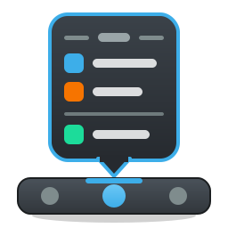
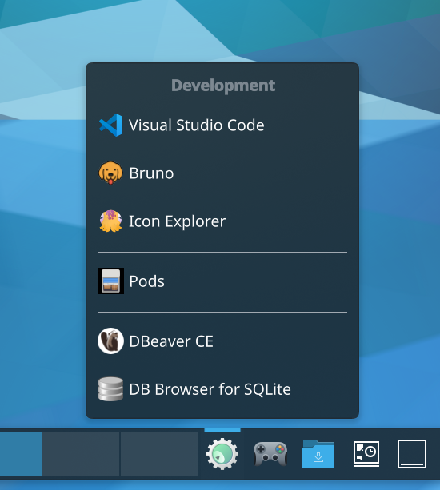
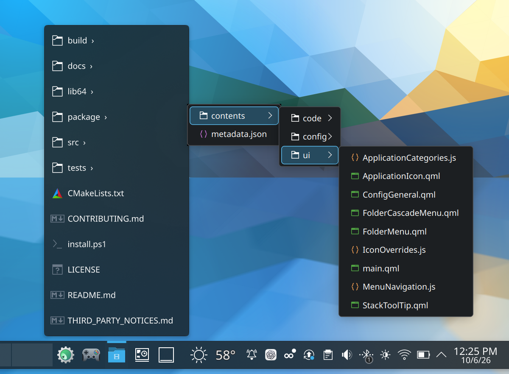
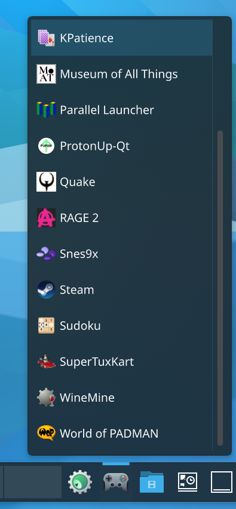
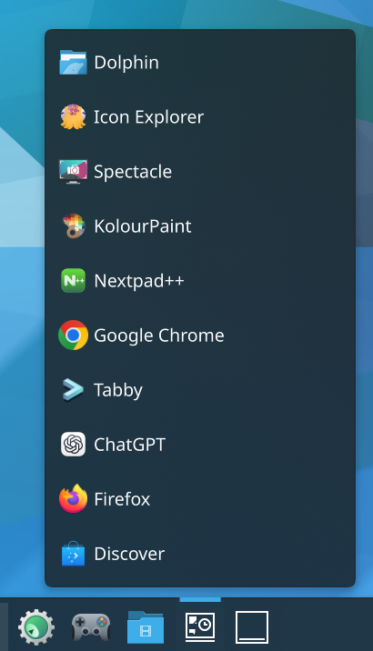
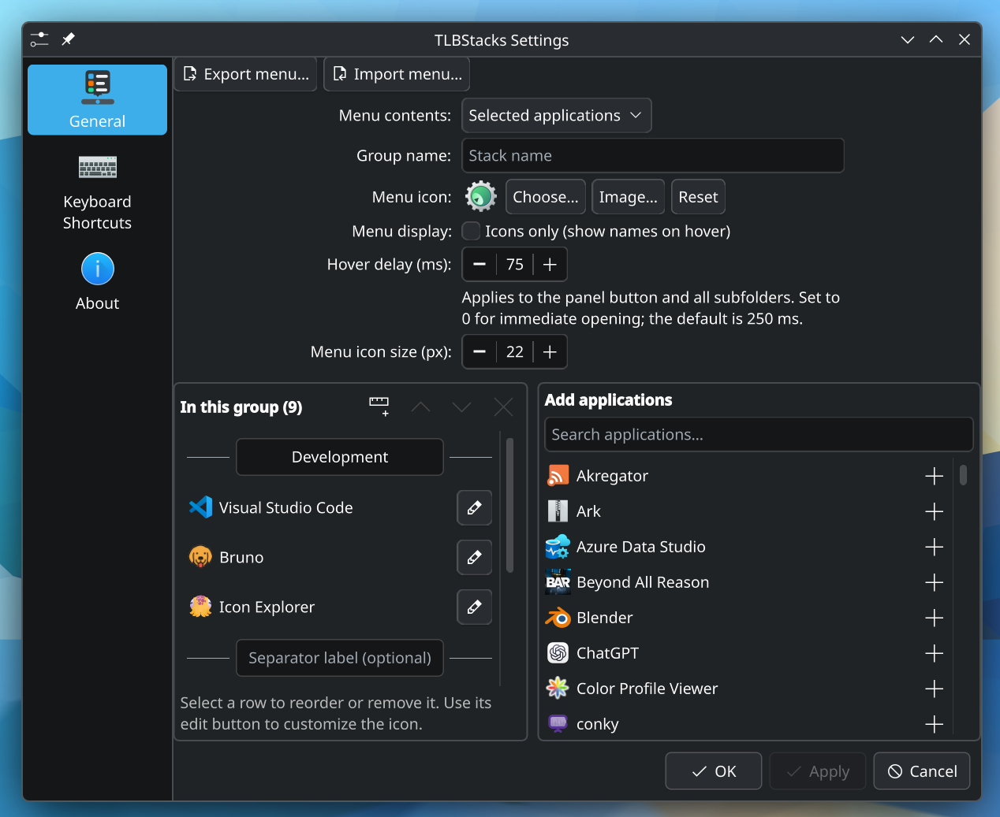

  &nbsp;TLBStacks

**Application groups and live folder menus for KDE Plasma 6.**

Keep related tools together without filling your panel with individual launchers.
Add a TLBStacks widget for each group, give it a name and icon, and open its menu
by clicking or hovering over the panel button.

Inspired by the original Windows True Launch Bar, TLBStacks is an independent
Linux project focused on individual Plasma widgets. It is not a task manager or
a replacement desktop panel.

<!-- IMAGE 1 (hero): docs/images/hero-panel.png
     Open Selected Applications menu with titled separators, attached to the panel. -->

  

## What it does

- **Selected Applications:** build an ordered group of installed applications,
  add visual separators with optional titles (e.g. `--- Office ---`), customize icons, and remove shortcuts without
  uninstalling applications.
- **Application Categories:** populate a stack from one or more desktop-entry
  categories, with a preview of matching applications in the editor.
- **Recent / Frequent Applications:** rank KDE-recorded app usage, optionally filtered
  by application categories and current Activity.
- **Live Folder:** browse a local folder and cascading subfolders, filter files
  with patterns, and move files to Trash from the context menu.
- **Your preferred presentation:** custom panel icons, configurable icon size,
  optional icons-only application menus, tooltips, and adjustable opening delay.
  Live Folder always displays filenames.
- **Mouse and keyboard navigation:** navigate menus with arrow keys, activate
  entries with Enter, and dismiss with Escape.
- **Portable menus:** export and import a stack, including custom icon images.

## Screenshots

<!-- IMAGE 3: docs/images/live-folder.png
     Live Folder menu with a cascading subfolder open to the side, plus the
     right-click context menu (Move to Trash) if it fits. -->

  

<!-- IMAGE 4a/4b: docs/images/categories.png and docs/images/recent-frequent.png
     Application Categories with a category cascade open (left); Recent / Frequent,
     ideally icons-only (right). Taken separately, shown side by side. -->
<table align="center">
  <tr>
    <td align="center"> Application Categories</td>
    <td align="center"> Recent / Frequent</td>
  </tr>
</table>

  

## Project status

Early development, tested primarily on Fedora with KDE Plasma and Wayland.
Other distributions may work, but installation paths and dependencies vary.
Screen-edge, scaling, and multi-monitor coverage is still incomplete; see
[testing and known verification gaps](docs/TESTING_AND_STATUS.md).

There is currently no packaged release or plugin SDK. Planned work is tracked in
[the feature tracker](docs/FEATURE_TRACKER.md); historical True Launch Bar features
are research material, not promises about this project.

## Getting started

You need KDE Plasma 6, a C++20 compiler, CMake, Qt 6 and KDE Frameworks 6 development
libraries, Python 3, and PowerShell for the supplied installer.

1. Clone this repository: `git clone https://github.com/mattisking/tlb-stacks.git`.
2. Follow [Build and install](docs/DEPLOYMENT.md), including its prerequisites.
3. Add **TLBStacks** through Plasma's widget picker and configure its content source.

The installer builds a native QML module as well as installing the widget package.
By default it restarts Plasma; review the deployment instructions first. If you
used the earlier project name, follow the [one-time migration instructions](docs/DEPLOYMENT.md#renaming-existing-installations).

## Documentation and contributions

- [Project guide](docs/README.md): documentation index and maintenance conventions.
- [Entry model and navigation](docs/STACK_ENTRY_MODEL.md): current architecture.
- [Feature tracker](docs/FEATURE_TRACKER.md): requested and deferred work.
- [Contributing](CONTRIBUTING.md): bug reports, changes, and verification.
- [Issues](https://github.com/mattisking/tlb-stacks/issues): report a problem or propose an improvement.

## License and attribution

Copyright © 2026 Matt Philmon and contributors.

TLBStacks original source code and project-authored documentation are licensed
under the **GNU General Public License, version 3 or (at your option) any later
version** (`GPL-3.0-or-later`). See [LICENSE](LICENSE). The software is provided
without warranty.
See [third-party notices](THIRD_PARTY_NOTICES.md) for the historical manual and
dependencies. TLBStacks is not affiliated with TORDEX or the original True Launch Bar.
